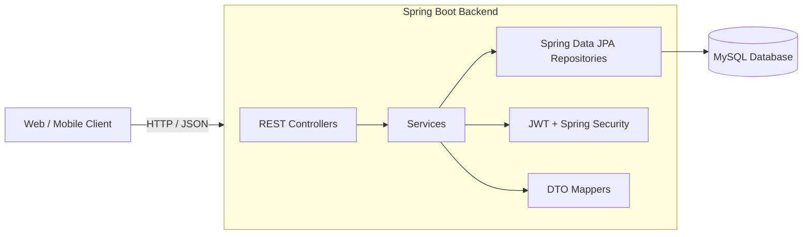

## Movie Reservation – Backend Service

A production‑style Spring Boot backend for an online cinema ticketing platform.  
It manages movies, theaters, rooms, showtimes, seats, reservations, and tickets with JWT authentication, seat locking, and QR‑based tickets.

---

## Introduction

The **Movie Reservation** project is a backend service that provides the core capabilities required by a modern cinema or online ticketing system:

- Manage movies, theaters, rooms, and seating layouts
- Publish showtimes and seat availability
- Reserve seats with proper locking and expiration
- Issue tickets with QR codes for check‑in
- Protect APIs with JWT‑based authentication and role‑based authorization

This documentation is intended for:

- **Backend engineers** extending or integrating with the API
- **Frontend / mobile developers** building customer or admin UIs
- **DevOps / SRE teams** deploying and operating the service
- **Interviewers & reviewers** evaluating this project as portfolio work

> Note: This repository currently focuses on the **backend**. A separate frontend can consume these REST APIs.

---

## Key Features

- **Movie catalog management**
  - Create, update, delete, and list movies.
  - Search by title and filter by genre.

- **Theater & room management**
  - Configure theaters, rooms, and seating layouts.
  - Manage seat types (e.g., Regular, VIP) and statuses.

- **Showtime scheduling**
  - Create and update showtimes per movie and room.
  - Prevent overlapping showtimes and invalid time ranges.

- **Seat reservation & tickets**
  - Reserve one or more seats for a given showtime.
  - Track reservation, ticket, and seat statuses.

- **Authentication & authorization**
  - JWT-based stateless authentication.
  - Role-based access control (e.g., `ROLE_ADMIN` for content management).
  - Secure defaults via Spring Security.

- **Robust domain model**
  - Rich entity relationships: `Movie`, `Theater`, `Room`, `Showtime`, `Seat`, `Reservation`, `Ticket`, etc.
  - DTO layer and mappers for clean API contracts.

---

## Overall Architecture

### High-Level System Diagram



- **Clients** communicate with the API using REST+JSON.
- **Controllers** expose REST endpoints.
- **Services** encapsulate business logic (e.g., showtime validation, reservation rules).
- **Repositories** implement data access via Spring Data JPA.
- **Security** is handled via a JWT filter + Spring Security configuration.
- **Database** is MySQL, using Hibernate for ORM.

### Package Layout (Backend)

- `config` – Application and security configuration (`SecurityConfig`, `DataInitializer`, etc.).
- `controller` – REST controllers for movies, theaters, rooms, showtimes, seats, users, reservations.
- `service` – Business services for each domain (e.g., `MovieService`, `ShowtimeService`).
- `repositories` – Spring Data JPA repositories.
- `entity` – JPA entities for all core domain objects.
- `dto` – Request/response DTOs and enums (statuses, seat types, etc.).
- `mapper` – Mapping between entities and DTOs.
- `security` – JWT filter and related authentication components.
- `exception` – Global exception handling and domain-specific exceptions.

---

## Installation

### Prerequisites

- **Java**: 21+ (project targets a recent Java version; adjust as needed per your JDK)
- **Maven**: 3.8+  
- **MySQL**: 8.x (or compatible)
- **Git** (optional, for source control)

### 1. Clone the Repository

```bash
git clone <your-repo-url> movie-reservation
cd movie-reservation
```

> Replace `<your-repo-url>` with your actual Git repository URL.

### 2. Navigate to Backend

```bash
cd backend
```

### 3. Configure Database

Ensure you have a running MySQL instance and a user with privileges to create/modify the database.

Default configuration (from `application.properties`):

```properties
spring.datasource.url=jdbc:mysql://localhost:3306/movie_reservation_db?createDatabaseIfNotExist=true
spring.datasource.username=root
spring.datasource.password=123456
```

You can either:

- Create the `movie_reservation_db` schema manually, **or**
- Let Hibernate create it via `?createDatabaseIfNotExist=true`.

### 4. Build the Project

```bash
mvn clean install
```

This will:

- Resolve dependencies (Spring Boot, Spring Data JPA, Spring Security, JWT, ModelMapper, etc.).
- Compile the code.
- Package the backend as a runnable JAR.

---

## Running the Project

You can run the backend either via Maven or as a standalone JAR.

### Option 1: Maven (Development)

From the `backend` directory:

```bash
mvn spring-boot:run
```

### Option 2: Executable JAR

After `mvn clean install`:

```bash
cd backend
java -jar target/mrs-0.0.1-SNAPSHOT.jar
```

### Default Runtime Settings

- **Port**: `1712` (see `application.properties`)
- **Base URL**: `http://localhost:1712`

Once running, you can test a public endpoint such as listing movies:

```bash
curl http://localhost:1712/movies
```

---

## Environment Configuration

Configuration is currently managed through `src/main/resources/application.properties`. For production, you should override sensitive values via environment variables or externalized config.

### Core Properties

```properties
spring.application.name=Movie Reservation
server.port=1712

# Admin bootstrap user
admin.email=admin@gmail.com
admin.password=12345

# JWT
secretJwtString=karotdev17122001karotdev17122001
expirationDate=86400000

# Database
spring.datasource.url=jdbc:mysql://localhost:3306/movie_reservation_db?createDatabaseIfNotExist=true
spring.datasource.driver-class-name=com.mysql.cj.jdbc.Driver
spring.datasource.username=root
spring.datasource.password=123456

# JPA / Hibernate
spring.jpa.database-platform=org.hibernate.dialect.MySQLDialect
spring.jpa.hibernate.ddl-auto=update
spring.jpa.showtime-sql=true
spring.jpa.properties.hibernate.format_sql=true
```

> **Security note:** Do **not** commit real secrets (JWT keys, DB passwords) to version control. Use environment-specific overrides instead.

### Recommended Overrides via Environment Variables (for Prod)

Set environment variables to override properties, for example:

```bash
export SPRING_DATASOURCE_URL="jdbc:mysql://<host>:3306/movie_reservation_db"
export SPRING_DATASOURCE_USERNAME="<db_user>"
export SPRING_DATASOURCE_PASSWORD="<db_password>"
export SECRETJWTSTRING="<strong-random-secret>"
export EXPIRATIONDATE="86400000"
export SERVER_PORT="8080"
```

Spring Boot will map these to configuration properties automatically when using the correct naming conventions or you can define a separate `application-prod.properties` and activate it via `SPRING_PROFILES_ACTIVE=prod`.

---

## Folder Structure

Here is an overview of the project structure focusing on the backend:

```bash
movie-reservation/
├─ backend/
│  ├─ pom.xml
│  ├─ src/
│  │  ├─ main/
│  │  │  ├─ java/com/karot/mrs/backend/
│  │  │  │  ├─ MovieReservationApplication.java
│  │  │  │  ├─ config/
│  │  │  │  ├─ controller/
│  │  │  │  ├─ service/
│  │  │  │  ├─ repositories/
│  │  │  │  ├─ entity/
│  │  │  │  ├─ dto/
│  │  │  │  ├─ mapper/
│  │  │  │  ├─ security/
│  │  │  │  └─ exception/
│  │  │  └─ resources/
│  │  │     └─ application.properties
│  │  └─ test/        # (if/when tests are added)
│  └─ target/         # build output
└─ note.txt           # project notes or scratchpad
```

### Key Backend Modules

- **`config`**
  - Application and security configuration, e.g., `SecurityConfig`, `DataInitializer`.

- **`controller`**
  - REST controllers, e.g., `MovieController`, `TheaterController`, `RoomController`, `ShowtimeController`, `SeatController`, `UserController`, `ReservationController`.

- **`service`**
  - Business services for each domain: `MovieService`, `TheaterService`, `ShowtimeService`, `RoomService`, `SeatService`, etc.

- **`repositories`**
  - Spring Data JPA repositories for each entity: `MovieRepository`, `TheaterRepository`, `RoomRepository`, `ShowtimeRepository`, `SeatRepository`, etc.

- **`entity`**
  - JPA entities: `Movie`, `Theater`, `Room`, `Showtime`, `Seat`, `Reservation`, `Ticket`, `ShowtimeSeat`, `TicketSeat`, `User`, etc.

- **`dto` & `mapper`**
  - Request/response DTOs and mapping logic, e.g., `CreateMovieRequest`, `UpdateMovieRequest`, `MovieDto`, `TheaterDto`, `ShowtimeDto`, `SeatDto`, `ReservationResponse`, plus mappers like `MovieMapper`, `TheaterMapper`, `ShowtimeMapper`, `SeatMapper`, `RoomMapper`.

- **`security`**
  - JWT filter and authentication configuration, e.g., `JwtAuthFilter`, password encoder configuration in `SecurityConfig`.

- **`exception`**
  - Domain-specific exceptions and `GlobalExceptionHandler`.

---

## Using the API – Examples

### Authentication

Authentication endpoints are typically under `/auth/**`. Once you obtain a JWT, include it in the `Authorization` header:

```bash
Authorization: Bearer <your-jwt-token>
```

> Adjust the exact auth endpoints according to your implementation—e.g., `/auth/login`, `/auth/register`.

### 1. List All Movies (Public)

```bash
curl http://localhost:1712/movies
```

**Response (example):**

```json
[
  {
    "id": 1,
    "title": "Inception",
    "genre": "Sci-Fi",
    "durationMinutes": 148,
    "rating": "PG-13"
  }
]
```

### 2. Search Movies by Title

```bash
curl "http://localhost:1712/movies/search?title=Inception"
```

### 3. Create a Movie (Admin Only)

`MovieController` secures creation with `@PreAuthorize("hasRole('ADMIN')")`.

```bash
curl -X POST http://localhost:1712/movies \
  -H "Content-Type: application/json" \
  -H "Authorization: Bearer <admin-jwt>" \
  -d '{
    "title": "Interstellar",
    "genre": "Sci-Fi",
    "durationMinutes": 169,
    "description": "A team of explorers travel through a wormhole in space..."
  }'
```

### 4. Reserve Seats (Example Shape)

Your reservation flow likely uses an endpoint under `/reservations` and a DTO like `ReserveSeatsRequest`. A typical call might look like:

```bash
curl -X POST http://localhost:1712/reservations \
  -H "Content-Type: application/json" \
  -H "Authorization: Bearer <user-jwt>" \
  -d '{
    "showtimeId": 42,
    "seatIds": [101, 102, 103]
  }'
```

> Check the actual controller and DTO definitions (`ReservationController`, `ReserveSeatsRequest`) to confirm the exact payload and endpoint name.

---

## Contribution Guidelines

We welcome contributions that improve stability, performance, documentation, or add well-scoped new features.

### How to Contribute

1. **Fork & clone**

   ```bash
   git clone <your-fork-url>
   cd movie-reservation/backend
   ```

2. **Create a feature branch**

   ```bash
   git checkout -b feature/<short-description>
   ```

3. **Make your changes**

   - Keep methods and classes small and focused.
   - Follow existing package structure and naming conventions.
   - Favor services + DTOs to keep controllers thin.

4. **Run checks**

   At minimum:

   ```bash
   mvn clean test
   mvn -DskipTests=false verify
   ```

   (Add more checks as the project grows—e.g., static analysis, formatting.)

5. **Submit a pull request**

   - Include a clear description of:
     - What you changed.
     - Why it’s needed.
     - How you tested it (commands, scenarios).
   - Reference related issues if applicable.

### Coding Standards

- **Java**: Use modern Java idioms consistent with Spring Boot practices.
- **Spring Boot**:
  - Controllers should be thin; services hold business logic.
  - Use DTOs for input/output; avoid leaking entity classes directly.
  - Use `@PreAuthorize` and other annotations for method-level security.
- **Error handling**:
  - Utilize the existing `GlobalExceptionHandler`.
  - Prefer domain-specific exception classes where appropriate.

---

## License

This project is intended to be licensed under the **MIT License** (or any license your organization prefers).

- Add a `LICENSE` file at the root of the repository containing the full license text.
- Update this section if you choose a different license (e.g., Apache 2.0, GPL).

Until a license file is added, treat this project as **all rights reserved**.

---

## Roadmap

This is a suggested roadmap; adjust based on your product goals.

- **Short term**
  - Finalize and document all existing REST endpoints.
  - Complete the reservation and ticketing flows (including `ReservationController`).
  - Add comprehensive unit and integration tests.
  - Introduce OpenAPI/Swagger documentation for the API.

- **Medium term**
  - Add a dedicated **frontend web app** (React/Next.js or similar) for customers and admins.
  - Implement **seat map visualization** and interactive seat selection.
  - Integrate **payment providers** for online ticket purchase.
  - Add **email/SMS notifications** for bookings and cancellations.

- **Long term**
  - Multi-tenant support for multiple cinema chains.
  - Advanced analytics: occupancy, revenue forecasting, customer behavior.
  - Public SDKs or client libraries (e.g., TypeScript/Java/Kotlin clients).
  - Deployment blueprints (Docker, Kubernetes, Helm charts) for production environments.

